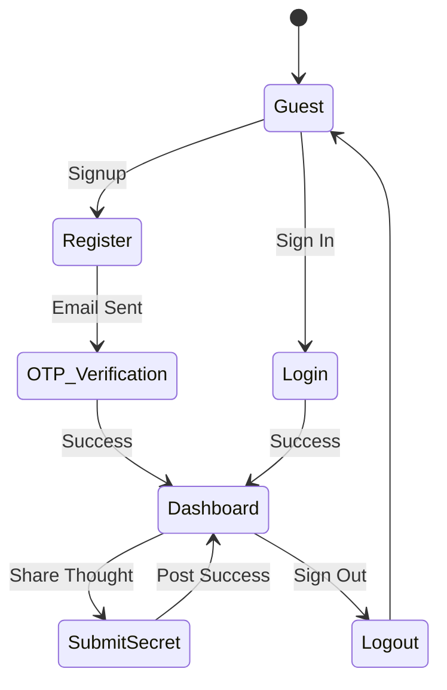
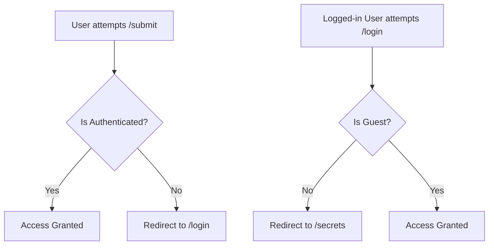

# 🌊 Application Flow & User Journey

Follow the path of a secret keeper through our intuitive, secure ecosystem.

---

## 🛤️ The User Lifecycle

---

## 📱 Interactive Screen Mapping

### **Phase 1: The Gatekeeper**
| Screen | Route | Visual | Purpose |
| :--- | :--- | :--- | :--- |
| **Landing** | `/` | 🏠 | Welcome & Value Prop |
| **Auth** | `/login` | 🔑 | Entry to the platform |
| **Signup** | `/register`| 📝 | Community Onboarding |

### **Phase 2: The Inner Circle**
| Screen | Route | Visual | Purpose |
| :--- | :--- | :--- | :--- |
| **Feed** | `/secrets` | 🕵️ | The Anonymous Wall |
| **Editor** | `/submit` | ✍️ | Ghost-writing your secret |
| **Account** | `/profile` | 👤 | Managing your presence |

---

## 🔒 Security Gateways (Guards)

We use Angular **Functional Guards** to protect our ecosystem:

---

## ⚡ Real-time Transitions
- **Auth Interceptors:** Every request automatically attaches the `Bearer Token` without developer overhead.
- **Route Resolvers:** Ensuring data is fetched *before* the component renders, preventing "layout shift."
- **Animated Routes:** Smooth slide transitions between the Feed and the Editor screens.
