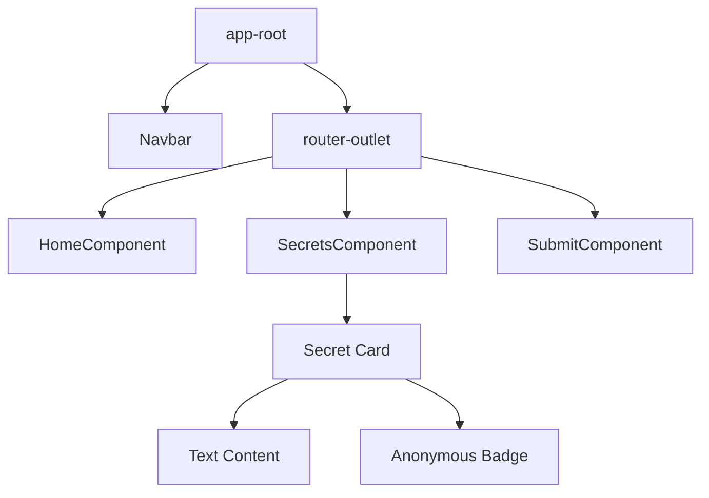

# 🎨 UI/UX Design Specification

The design of **Secrets** is a blend of mystery and minimalism. We prioritize content and anonymity through a "Card-First" design language.

---

## 🌈 Visual Palette

| Color | Hex Code | Preview | Usage |
| :--- | :--- | :--- | :--- |
| **Ash Gray** | `#EEEEEE` |  | Primary Background |
| **Dark Onyx** | `#212529` |  | Primary Buttons / Text |
| **Ghost White** | `#FFFFFF` |  | Card Backgrounds |
| **Crimson** | `#DC3545` |  | Action / Danger Buttons |

---

## 🧱 Component Blueprint

---

## 📱 UI Previews (Simulated)

### **1. The Landing Hero**
> A centered, high-impact jumbotron that sets the tone.

    <h1 style="font-size: 3rem; margin-bottom: 0;">🔑</h1>
    <h2 style="font-weight: 300; margin-top: 10px;">Secrets</h2>
    
Don't keep your secrets, share them anonymously!

    

        <button style="background-color: #212529; color: white; padding: 10px 20px; border: none; border-radius: 5px; margin-right: 10px;">Login</button>
        <button style="background-color: #f8f9fa; color: #212529; border: 1px solid #212529; padding: 10px 20px; border-radius: 5px;">Register</button>
    

### **2. The Secret Card**
> Minimalist, floating cards designed to highlight the text.

    
"I actually like pineapple on pizza, but I tell everyone I hate it so I can fit in at parties..."

    

    Anonymous Contributor

---

## ⚙️ Interactive Elements
- **Hover Transitions:** Cards lift slightly (`transform: translateY(-5px)`) on hover to indicate interactivity.
- **Glassmorphism:** Navigation bar uses a subtle blur effect on scroll.
- **Loading States:** Skeleton loaders are used while fetching secrets from the MongoDB backend to ensure a perceived performance boost.
