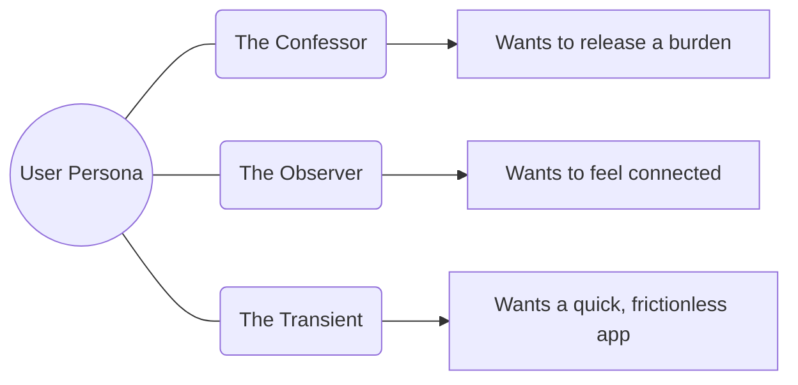

# 📄 Product Requirement Document (PRD)

Building a safe harbor for the unspoken.

---

## 🚀 The Vision
> **To provide a zero-judgment zone where vulnerability is celebrated through anonymity.**

---

## 🎯 Strategic Pillars

| Pillar | Icon | Description |
| :--- | :--- | :--- |
| **Privacy** | 🛡️ | Your identity is never linked to your public words. |
| **Simplicity** | ✨ | Zero distractions. Just you and the secret. |
| **Security** | 🔒 | Bank-grade hashing and OAuth2 protection. |
| **Catharsis** | 🌊 | The relief of sharing what's been hidden. |

---

## 📋 Core Feature Matrix

### **1. Identity & Access**
- [x] **OTP Verification:** Kill the bots, keep the humans.
- [x] **Google SSO:** One-click entry to anonymity.
- [x] **JWT Security:** Persistent sessions without server storage.

### **2. The Secret Engine**
- [x] **Anonymous Posting:** No names, just thoughts.
- [x] **Rich Text Area:** A canvas for your confessions.
- [x] **Global Feed:** See the world's secrets in real-time.

---

## 🛠️ User Personas

---

## 📈 Roadmap to V2

### **Short-Term (Q3 2026)**
- 🎭 **Mood Tags:** Tag secrets with #Regret, #Joy, or #Work.
- 💖 **Encouragement:** Subtle "Hugs" instead of standard "Likes".

### **Long-Term (Q4 2026)**
- 🌍 **Geospatial Secrets:** View secrets from your city (anonymized).
- 🕒 **Ephemeral Mode:** Secrets that vanish after 24 hours.

---

## 🛡️ Trust & Safety
Even in anonymity, we maintain a standard. The backend includes **Content Filtering** hooks to prevent malicious spam or harmful content, ensuring the "Secrets" community remains a constructive space.
