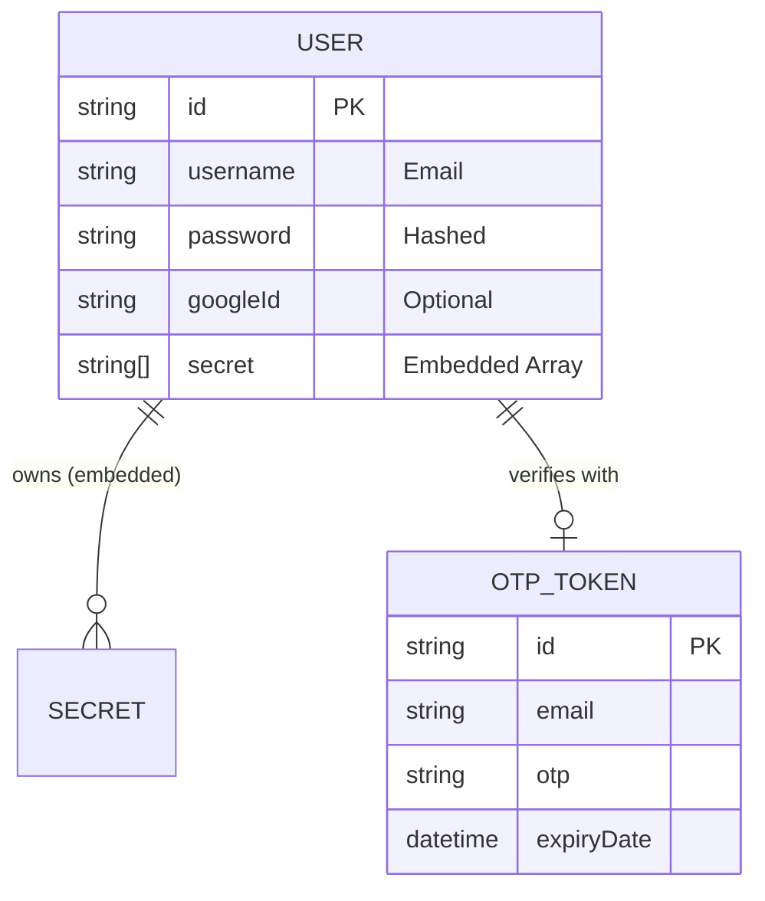
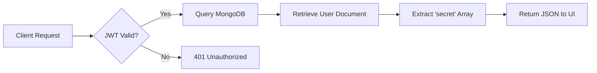

# 📊 Database Schema

Our database architecture is designed for high speed and low latency, utilizing MongoDB's document-oriented structure.

---

## 🗺️ Entity Relationship (ER) Diagram

---

## 📁 Collection Deep-Dive

### **1. Users Collection**
> Stores user profiles and their collection of secrets.

| Field | Type | Visual | Description |
| :--- | :--- | :--- | :--- |
| `_id` | `ObjectId` | 🆔 | Unique Primary Key |
| `username` | `String` | 📧 | User's unique email |
| `password` | `String` | 🔒 | BCrypt Hashed String |
| `googleId` | `String` | 🌐 | Google SSO Identifier |
| `secret` | `Array<String>` | 📝 | Embedded Secret Strings |

### **2. OTP Tokens Collection**
> Transient storage for security challenges.

| Field | Type | Visual | Description |
| :--- | :--- | :--- | :--- |
| `_id` | `ObjectId` | 🆔 | Unique Identifier |
| `email` | `String` | 📧 | Recipient Address |
| `otp` | `String` | 🔢 | 6-digit verification code |
| `expiryDate` | `Date` | ⏳ | Automatic expiration time |

---

## 🛠️ Data Architecture Decisions

### **Why Embedding Secrets?**
Instead of a separate `secrets` collection, we embed secrets directly in the `User` document.

1.  **Read Speed:** One query retrieves the user AND all their secrets.
2.  **Simplicity:** No complex `$lookup` or joins required.
3.  **Performance:** Since secrets are just text strings, document size remains manageable.

### **The Flow of Data**

