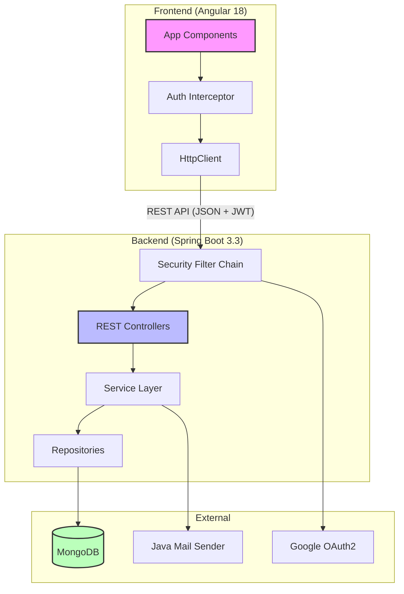
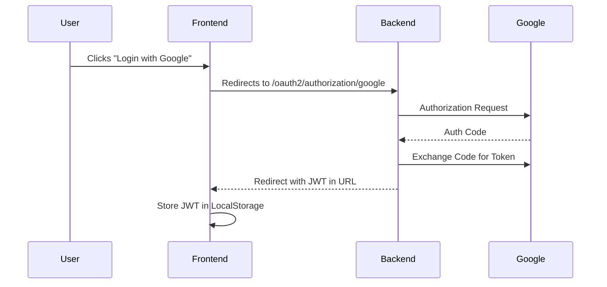

# 🛠️ Technical Specification

Explore the engine behind **Secrets**. This document outlines our modern, scalable, and secure architecture.

---

## 🏗️ System Architecture

---

## 💻 Tech Stack Breakdown

### **Frontend: The User Experience**
| Technology | Badge | Purpose |
| :--- | :--- | :--- |
| **Angular 18** |  | Standalone components & modular architecture. |
| **TypeScript** |  | Type-safe development. |
| **RxJS** |  | Reactive state management. |
| **Bootstrap 5** |  | Responsive design & layout. |

### **Backend: The Logic Engine**
| Technology | Badge | Purpose |
| :--- | :--- | :--- |
| **Java 21** |  | Latest LTS performance features. |
| **Spring Boot 3** |  | Production-ready microservice foundation. |
| **Spring Security** |  | JWT & OAuth2 orchestration. |
| **MongoDB** |  | Flexible NoSQL document storage. |

---

## 🔐 Authentication Data Flow

---

## 🚀 Key Performance Highlights
- **Statelessness:** No server-side sessions; perfect for horizontal scaling.
- **Async Processing:** OTP emails are sent asynchronously to ensure fast UI response.
- **Type Safety:** Shared DTO structures ensure consistency between Java and TypeScript.
